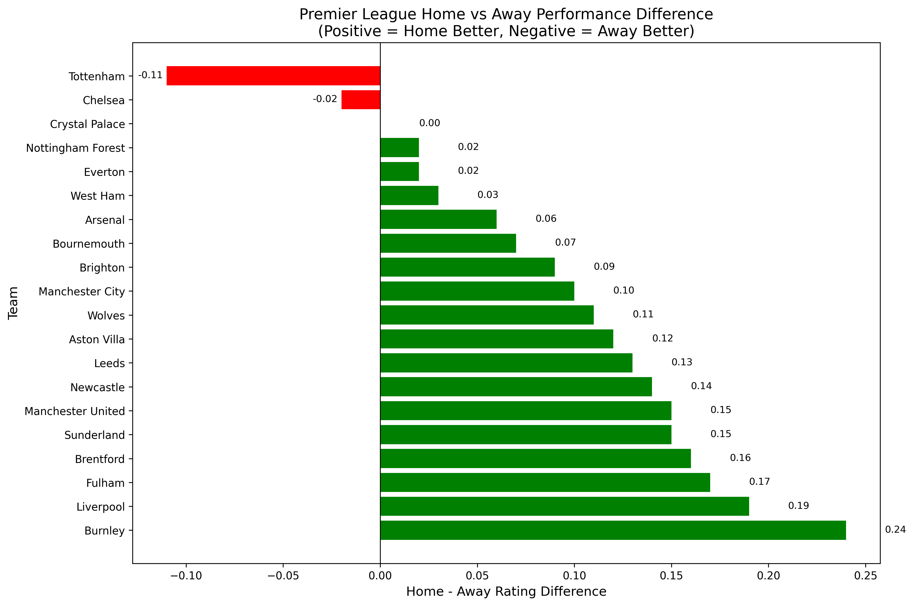

# Home vs Away Performance Analysis (Premier League 2025-26)

## Question

Which teams are "Home Dominant" (perform significantly better at home) and which are "Away Dominant" (perform better on the road)?

## Data Source

WhoScored.com - Premier League team statistics for the 2025-26 season. Data includes:
- Home stats (team_home_stats.csv)
- Away stats (team_away_stats.csv)

The analysis uses the **WhoScored Rating** (a composite score from 0-10 based on over 200 statistical categories).

## Method

1. Extract `Team` and `Rating` columns from both home and away datasets
2. Merge on team name
3. Calculate difference: `Diff = Home_Rating - Away_Rating`
4. Classify teams:
   - **HOME DOMINANT**: Diff > 0 (home rating higher than away)
   - **BALANCED**: Diff = 0 (equal home and away rating)
   - **AWAY DOMINANT**: Diff < 0 (away rating higher than home)

## Results

### HOME DOMINANT (Home - Away > 0)

| Team | Home Rating | Away Rating | Difference |
|------|-------------|-------------|------------|
| Burnley | 6.56 | 6.32 | **+0.24** |
| Liverpool | 6.79 | 6.60 | **+0.19** |
| Fulham | 6.66 | 6.49 | **+0.17** |
| Brentford | 6.74 | 6.58 | **+0.16** |
| Sunderland | 6.66 | 6.51 | **+0.15** |
| Manchester United | 6.83 | 6.68 | **+0.15** |
| Newcastle | 6.68 | 6.54 | **+0.14** |
| Leeds | 6.67 | 6.54 | **+0.13** |
| Aston Villa | 6.64 | 6.52 | **+0.12** |
| Wolves | 6.50 | 6.39 | **+0.11** |
| Manchester City | 6.94 | 6.84 | **+0.10** |
| Brighton | 6.65 | 6.56 | **+0.09** |
| Bournemouth | 6.70 | 6.63 | **+0.07** |
| Arsenal | 6.82 | 6.76 | **+0.06** |
| West Ham | 6.61 | 6.58 | **+0.03** |
| Everton | 6.69 | 6.67 | **+0.02** |
| Nottingham Forest | 6.62 | 6.60 | **+0.02** |

### BALANCED (Home - Away = 0)

| Team | Home Rating | Away Rating | Difference |
|------|-------------|-------------|------------|
| Crystal Palace | 6.62 | 6.62 | **0.00** |

### AWAY DOMINANT (Home - Away < 0)

| Team | Home Rating | Away Rating | Difference |
|------|-------------|-------------|------------|
| Chelsea | 6.63 | 6.65 | **-0.02** |
| Tottenham | 6.53 | 6.64 | **-0.11** |

## Visualization



*Horizontal bar chart showing home-away rating differences. Green bars indicate home dominance, red bars indicate away dominance.*

## Key Findings

1. **Burnley is the most home-reliant team** (+0.24 difference).  
   Their home rating (6.56) is 0.24 points higher than their away rating (6.32).  
   However, this is driven more by their poor away form (6.32, near the bottom of the league) than exceptional home performance (6.56, mid-table).

2. **Only two teams have a negative home-away difference:** Tottenham (-0.11) and Chelsea (-0.02), meaning they perform slightly better away from home.Tottenham's    away advantage is the most significant in the league.
3. **Crystal Palace is perfectly balanced** (0.00 difference). Their performance is identical home and away.

4. **Strong teams have smaller differences**: Liverpool (+0.19), Manchester City (+0.10), and Arsenal (+0.06) all have positive differences, but they perform well both home and away. Their home advantage exists but is not extreme.

5. **17 out of 20 teams** have a positive home-away difference, confirming that home advantage is real in the Premier League.

## How to Reproduce

1. Clone the repository
2. Install dependencies: `pip install -r requirements.txt`
3. Run the analysis notebook: `notebooks/01_home_away_analysis.ipynb`

## Code

The analysis uses Python with pandas and matplotlib:

```python
# Load data
home_df = pd.read_csv('data/processed/team_home_stats.csv')
away_df = pd.read_csv('data/processed/team_away_stats.csv')
```
```python
# Calculate difference
home_rating = home_df[['Team', 'Rating']].rename(columns={'Rating': 'Home_Rating'})
away_rating = away_df[['Team', 'Rating']].rename(columns={'Rating': 'Away_Rating'})
comparison = pd.merge(home_rating, away_rating, on='Team')
comparison['Diff'] = comparison['Home_Rating'] - comparison['Away_Rating']
comparison_sorted = comparison.sort_values('Diff', ascending=False)
```


